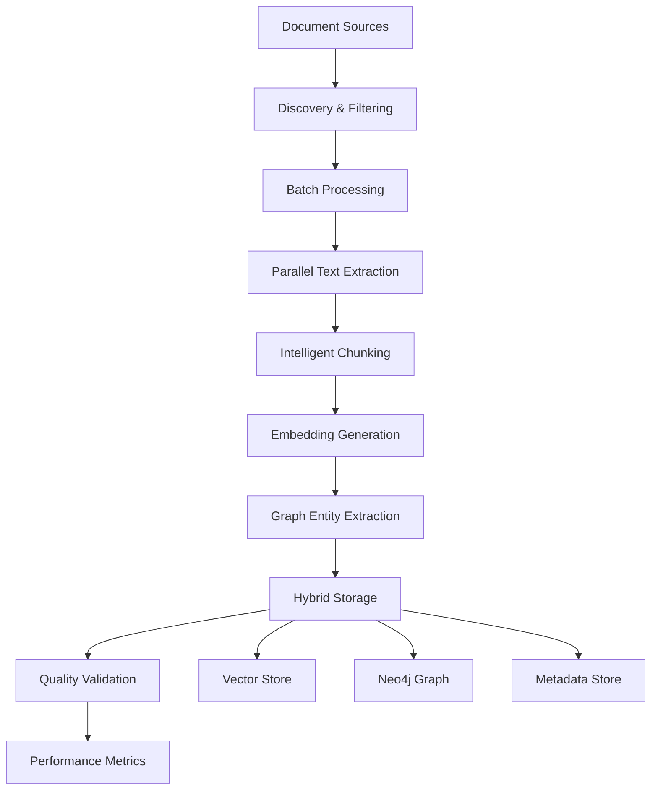

# Smart RAG System: Investigation & Import Pipeline
**Vollständiges Design für hochperformante Dokumenten-Ingestion**

## 🎯 Überblick

Das Import-Pipeline-Design integriert die bestehende Investigation-Pipeline in unser Smart RAG System und erweitert sie um moderne Design Patterns und Hybrid-Strategien.

## 📋 Architektur-Übersicht



## 🏗️ Core Components

### 1. DocumentIngestionOrchestrator
**Hauptkoordinator für den gesamten Import-Prozess**

```python
class DocumentIngestionOrchestrator:
    """
    Orchestriert den kompletten Import-Prozess mit:
    - Strategy Pattern für verschiedene Ingestion-Strategien  
    - Observer Pattern für Monitoring
    - Chain of Responsibility für Processing-Pipeline
    - Factory Pattern für Component-Erstellung
    """
    
    def __init__(self, config: IngestionConfig, rag_system: SmartRAGSystem):
        self.config = config
        self.rag_system = rag_system
        self.event_manager = rag_system.event_manager
        
        # Strategy für verschiedene Ingestion-Modi
        self.ingestion_strategy = self._create_ingestion_strategy()
        
        # Processing Pipeline
        self.pipeline = self._build_processing_pipeline()
        
        # Monitoring
        self.metrics_collector = IngestionMetricsCollector()
        
    async def ingest_documents(self, sources: List[str]) -> IngestionResult:
        """Hauptmethode für Dokumenten-Import"""
        return await self.ingestion_strategy.execute(sources, self.pipeline)
```

### 2. Ingestion Strategies

#### SpeedOptimizedStrategy
```python
class SpeedOptimizedStrategy(BaseIngestionStrategy):
    """
    Maximale Geschwindigkeit - minimale LLM-Nutzung
    - Lokale Embeddings (sentence-transformers)
    - Parallele Verarbeitung
    - Basis-Metadaten nur
    - 90% Qualität, 10x Geschwindigkeit
    """
    
    async def execute(self, sources: List[str], pipeline: ProcessingPipeline) -> IngestionResult:
        # Bulk-Verarbeitung ohne LLM-Calls
        # Optimierte Embedding-Generierung
        # Basis Graph-Extraktion
        pass
```

#### QualityOptimizedStrategy
```python
class QualityOptimizedStrategy(BaseIngestionStrategy):
    """
    Maximale Qualität - intensive LLM-Nutzung
    - Semantische Analyse aller Dokumente
    - Deep Entity Extraction
    - Cross-Document Relationship Analysis
    - 100% Qualität, 3x längere Zeit
    """
    
    async def execute(self, sources: List[str], pipeline: ProcessingPipeline) -> IngestionResult:
        # LLM-basierte Analyse
        # Erweiterte Graph-Konstruktion
        # Qualitätskontrolle
        pass
```

#### HybridStrategy (Recommended)
```python
class HybridIngestionStrategy(BaseIngestionStrategy):
    """
    Intelligenter Kompromiss zwischen Speed und Qualität
    - Adaptive LLM-Nutzung basierend auf Dokumenttyp
    - Selective Deep Analysis für wichtige Dokumente
    - Parallele Basis-Verarbeitung + nachgelagerte Verfeinerung
    - 95% Qualität, 2x Geschwindigkeit
    """
    
    async def execute(self, sources: List[str], pipeline: ProcessingPipeline) -> IngestionResult:
        # Phase 1: Schnelle Basis-Verarbeitung
        basic_results = await self._fast_processing_phase(sources)
        
        # Phase 2: Selektive Vertiefung
        enhanced_results = await self._selective_enhancement_phase(basic_results)
        
        # Phase 3: Graph-Integration
        final_results = await self._graph_integration_phase(enhanced_results)
        
        return final_results
```

### 3. Processing Pipeline Komponenten

#### DocumentDiscoveryService
```python
class DocumentDiscoveryService:
    """
    Erkennt und kategorisiert Dokumenten-Quellen
    - Dateisystem-Traversierung
    - Web-Scraping Capabilities  
    - API-Integration (SharePoint, Confluence, etc.)
    - Format-Erkennung und -Validierung
    """
    
    async def discover_sources(self, sources: List[str]) -> List[DocumentSource]:
        # Multi-threaded file discovery
        # URL validation und content-type detection
        # Duplicate detection via content hashing
        # Prioritization basierend auf Dateigröße/Typ
        pass
```

#### ContentExtractionService
```python
class ContentExtractionService:
    """
    Extrahiert Text aus verschiedenen Formaten
    - PDF: pypdf + OCR fallback
    - Office: python-docx, openpyxl
    - Web: BeautifulSoup + readability
    - Images: pytesseract OCR
    - Archive: automatisches Entpacken
    """
    
    async def extract_content(self, document: DocumentSource) -> ExtractedContent:
        # Format-spezifische Extraktion
        # Metadata preservation  
        # Error handling mit fallback-Strategien
        # Content quality assessment
        pass
```

#### IntelligentChunkingService
```python
class IntelligentChunkingService:
    """
    Erweiterte Chunking-Strategien
    - Semantic-aware chunking
    - Format-spezifische Splitting-Regeln
    - Overlap-Optimierung
    - Chunk-Quality-Assessment
    """
    
    async def create_chunks(self, content: ExtractedContent) -> List[DocumentChunk]:
        # Adaptive chunk size basierend auf content type
        # Semantic boundary detection
        # Cross-reference preservation
        # Metadata propagation
        pass
```

#### EmbeddingGenerationService
```python
class EmbeddingGenerationService:
    """
    Optimierte Embedding-Erstellung
    - Lokale Models für Geschwindigkeit
    - Batch-Processing für Effizienz
    - Multiple Embedding-Strategien
    - Caching für Deduplizierung
    """
    
    async def generate_embeddings(self, chunks: List[DocumentChunk]) -> List[ChunkWithEmbedding]:
        if self.config.use_local_embedding:
            return await self._local_batch_embedding(chunks)
        else:
            return await self._ollama_embedding(chunks)
```

#### GraphEntityExtractionService
```python
class GraphEntityExtractionService:
    """
    Extrahiert Entitäten und Beziehungen für Neo4j
    - Named Entity Recognition
    - Relationship Detection
    - Cross-Document Entity Linking
    - Confidence Scoring
    """
    
    async def extract_entities(self, chunks: List[DocumentChunk]) -> GraphData:
        # Batch-wise entity extraction
        # Relationship inference
        # Entity disambiguation
        # Graph structure optimization
        pass
```

## 🚀 Performance-Optimierungen

### 1. Parallelisierung-Strategien

```python
class ParallelProcessingManager:
    """
    Intelligente Parallelisierung basierend auf:
    - Verfügbare CPU-Kerne
    - Memory-Constraints
    - I/O-Bottlenecks
    - Processing-Type (CPU-bound vs I/O-bound)
    """
    
    def __init__(self, config: IngestionConfig):
        self.cpu_cores = psutil.cpu_count(logical=False)
        self.memory_gb = psutil.virtual_memory().total / (1024**3)
        
        # Adaptive worker allocation
        self.text_extraction_workers = min(self.cpu_cores, config.max_workers)
        self.embedding_workers = min(4, self.cpu_cores // 2)  # Memory-intensive
        self.graph_workers = 2  # I/O-bound zu Neo4j
        
    async def process_in_batches(self, items: List[Any], 
                               processor: Callable,
                               batch_size: int) -> List[Any]:
        """Optimierte Batch-Verarbeitung mit Memory-Management"""
        results = []
        
        for i in range(0, len(items), batch_size):
            batch = items[i:i + batch_size]
            
            # Parallele Verarbeitung des Batches
            batch_results = await asyncio.gather(
                *[processor(item) for item in batch],
                return_exceptions=True
            )
            
            # Error handling und result collection
            for result in batch_results:
                if isinstance(result, Exception):
                    self.logger.error(f"Processing error: {result}")
                else:
                    results.append(result)
            
            # Memory cleanup zwischen Batches
            if i % (batch_size * 5) == 0:
                await self._memory_cleanup()
                
        return results
```

### 2. Caching & Deduplizierung

```python
class ContentCacheManager:
    """
    Intelligentes Caching für Deduplizierung
    - Content-Hash-basierte Erkennung von Duplikaten
    - Incremental Updates
    - Cache-Invalidierung
    - Persistence für Session-übergreifende Nutzung
    """
    
    def __init__(self, cache_dir: Path):
        self.cache_dir = cache_dir
        self.content_hashes = {}
        self.embedding_cache = {}
        self.entity_cache = {}
        
    def get_content_hash(self, content: str) -> str:
        """Erstellt stabilen Hash für Content-Deduplizierung"""
        return hashlib.sha256(content.encode()).hexdigest()[:16]
        
    async def is_content_processed(self, content: str) -> bool:
        """Prüft ob Content bereits verarbeitet wurde"""
        content_hash = self.get_content_hash(content)
        return content_hash in self.content_hashes
        
    async def cache_embeddings(self, content_hash: str, embeddings: List[float]):
        """Cached Embeddings für Wiederverwendung"""
        self.embedding_cache[content_hash] = embeddings
        await self._persist_cache()
```

### 3. Adaptive Quality Control

```python
class QualityControlService:
    """
    Adaptive Qualitätskontrolle basierend auf:
    - Dokumenttyp und -wichtigkeit
    - Verfügbare Processing-Zeit
    - Qualitäts-Thresholds
    - User-Feedback
    """
    
    def __init__(self, config: IngestionConfig):
        self.quality_thresholds = {
            'embedding_confidence': 0.7,
            'entity_extraction_confidence': 0.8,
            'chunk_coherence_score': 0.6
        }
        
    async def assess_document_priority(self, doc: DocumentSource) -> DocumentPriority:
        """Bestimmt Processing-Priorität basierend auf Dokumentmerkmalen"""
        priority_score = 0
        
        # Dateigröße (größere Docs = höhere Priorität für Quality)
        if doc.size_mb > 10:
            priority_score += 2
            
        # Dateiformat (structured formats = höhere Priorität)
        if doc.format in ['.pdf', '.docx']:
            priority_score += 3
            
        # Aktualität
        if doc.modification_date > (datetime.now() - timedelta(days=30)):
            priority_score += 1
            
        return DocumentPriority.from_score(priority_score)
        
    async def validate_processing_results(self, result: ProcessingResult) -> ValidationResult:
        """Validiert Verarbeitungsqualität und entscheidet über Reprocessing"""
        validation = ValidationResult()
        
        # Embedding Quality Check
        if result.avg_embedding_confidence < self.quality_thresholds['embedding_confidence']:
            validation.needs_reprocessing = True
            validation.issues.append("Low embedding confidence")
            
        # Entity Extraction Quality
        if result.entity_count == 0 and result.content_length > 1000:
            validation.needs_reprocessing = True
            validation.issues.append("No entities extracted from substantial content")
            
        return validation
```

## 🔧 Konfiguration & Setup

### 1. Environment-spezifische Configs

```python
# Development Configuration
DEV_CONFIG = IngestionConfig(
    max_workers=4,
    batch_size=16,
    use_local_embedding=True,
    quality_mode="balanced",
    enable_caching=True,
    enable_monitoring=True
)

# Production Configuration  
PROD_CONFIG = IngestionConfig(
    max_workers=8,
    batch_size=64,
    chunk_batch_size=200,
    use_local_embedding=True,
    quality_mode="adaptive",
    enable_caching=True,
    enable_monitoring=True,
    enable_distributed_processing=True
)

# Speed-Optimized Configuration
SPEED_CONFIG = IngestionConfig(
    max_workers=16,
    batch_size=128,
    use_local_embedding=True,
    quality_mode="speed",
    skip_entity_extraction=False,  # Nur basic entities
    enable_parallel_embedding=True
)
```

### 2. Integration mit Smart RAG System

```python
class ImportPipelineIntegration:
    """
    Integration der Import-Pipeline in das Smart RAG System
    """
    
    def __init__(self, rag_system: SmartRAGSystem):
        self.rag_system = rag_system
        self.vector_store = rag_system.service_factory.get_vector_store()
        self.graph_store = rag_system.service_factory.get_graph_store()
        
    async def integrate_import_pipeline(self) -> DocumentIngestionOrchestrator:
        """Erstellt Import-Pipeline mit RAG-System Integration"""
        
        # Konfiguration basierend auf RAG-System Settings
        ingestion_config = self._create_config_from_rag_system()
        
        # Orchestrator mit RAG-System Services
        orchestrator = DocumentIngestionOrchestrator(
            config=ingestion_config,
            rag_system=self.rag_system
        )
        
        # Event-Handler für Import-Events registrieren
        self._register_import_event_handlers(orchestrator)
        
        return orchestrator
        
    def _register_import_event_handlers(self, orchestrator):
        """Registriert Event-Handler für Import-Process Monitoring"""
        
        @orchestrator.event_manager.on('document_processed')
        async def on_document_processed(event_data):
            # Update RAG system metrics
            await self.rag_system.event_manager.notify('import_document_processed', event_data)
            
        @orchestrator.event_manager.on('batch_completed')  
        async def on_batch_completed(event_data):
            # Trigger system optimization if needed
            if event_data['documents_count'] % 1000 == 0:
                await self.rag_system.optimize_system()
```

## 📊 Monitoring & Analytics

### 1. Real-time Monitoring Dashboard

```python
class ImportMonitoringDashboard:
    """
    Real-time Monitoring für Import-Progress
    """
    
    def __init__(self, orchestrator: DocumentIngestionOrchestrator):
        self.orchestrator = orchestrator
        self.metrics = ImportMetrics()
        
    async def start_monitoring(self):
        """Startet Real-time Monitoring"""
        while self.orchestrator.is_running:
            current_metrics = await self.orchestrator.get_current_metrics()
            
            # Console Output
            self._print_progress_bar(current_metrics)
            
            # Log Metrics
            self._log_metrics(current_metrics)
            
            # Check for Issues
            await self._check_for_issues(current_metrics)
            
            await asyncio.sleep(5)  # Update every 5 seconds
            
    def _print_progress_bar(self, metrics: ImportMetrics):
        """ASCII Progress Bar für Console"""
        progress = metrics.documents_processed / metrics.total_documents
        bar_length = 50
        filled_length = int(bar_length * progress)
        
        bar = '█' * filled_length + '-' * (bar_length - filled_length)
        
        print(f"\r📊 Progress: |{bar}| {progress*100:.1f}% "
              f"({metrics.documents_processed}/{metrics.total_documents}) "
              f"Speed: {metrics.documents_per_second:.1f} docs/sec "
              f"ETA: {metrics.estimated_completion}", end='')
```

### 2. Performance Analytics

```python
class PerformanceAnalyzer:
    """
    Analysiert Import-Performance und gibt Optimierungs-Empfehlungen
    """
    
    async def analyze_performance(self, metrics: ImportMetrics) -> PerformanceReport:
        """Erstellt detaillierten Performance-Report"""
        
        report = PerformanceReport()
        
        # Bottleneck Analysis
        if metrics.cpu_usage < 50 and metrics.documents_per_second < 10:
            report.bottlenecks.append("Low CPU utilization - increase batch size")
            
        if metrics.memory_usage > 80:
            report.bottlenecks.append("High memory usage - reduce batch size")
            
        if metrics.embedding_generation_time > metrics.text_extraction_time * 2:
            report.bottlenecks.append("Embedding generation is bottleneck - consider local embeddings")
            
        # Optimization Recommendations
        report.recommendations = await self._generate_recommendations(metrics)
        
        return report
        
    async def _generate_recommendations(self, metrics: ImportMetrics) -> List[str]:
        """Generiert spezifische Optimierungs-Empfehlungen"""
        recommendations = []
        
        if metrics.documents_per_second < 5:
            recommendations.append("Consider using SpeedOptimizedStrategy for initial import")
            
        if metrics.error_rate > 0.05:  # >5% Fehlerrate
            recommendations.append("High error rate detected - check document formats and sizes")
            
        if metrics.duplicate_detection_rate > 0.3:
            recommendations.append("High duplicate rate - improve source filtering")
            
        return recommendations
```

## 🎯 Usage Examples

### 1. Basic Import
```python
async def basic_import_example():
    """Einfacher Import mit Standard-Konfiguration"""
    
    # RAG System initialisieren
    rag_system = create_development_system()
    await rag_system.initialize()
    
    # Import Pipeline integrieren
    integration = ImportPipelineIntegration(rag_system)
    orchestrator = await integration.integrate_import_pipeline()
    
    # Dokumente importieren
    sources = [
        "./documents/",
        "https://example.com/docs/",
        "/path/to/specific/file.pdf"
    ]
    
    result = await orchestrator.ingest_documents(sources)
    
    print(f"✅ Import completed!")
    print(f"📄 Documents processed: {result.documents_processed}")
    print(f"🔤 Chunks created: {result.chunks_created}")
    print(f"⚡ Processing time: {result.processing_time:.2f} seconds")
```

### 2. Advanced Import with Custom Strategy
```python
async def advanced_import_example():
    """Erweiterte Import-Konfiguration"""
    
    # Custom Configuration
    custom_config = IngestionConfig(
        max_workers=8,
        batch_size=64,
        quality_mode="adaptive",
        supported_formats=['.pdf', '.docx', '.html', '.md'],
        enable_ocr=True,
        enable_web_scraping=True
    )
    
    # RAG System mit Custom Config
    rag_config = create_production_config()
    rag_config.default_retrieval_strategy = RetrievalStrategy.HYBRID
    
    rag_system = SmartRAGSystem(rag_config)
    await rag_system.initialize()
    
    # Import Pipeline mit Custom Strategy
    orchestrator = DocumentIngestionOrchestrator(custom_config, rag_system)
    orchestrator.set_strategy(HybridIngestionStrategy(custom_config))
    
    # Mit Monitoring
    monitoring = ImportMonitoringDashboard(orchestrator)
    monitoring_task = asyncio.create_task(monitoring.start_monitoring())
    
    # Import ausführen
    result = await orchestrator.ingest_documents([
        "./enterprise_docs/",
        "confluence://company.atlassian.net/wiki/",
        "sharepoint://company.sharepoint.com/documents/"
    ])
    
    # Monitoring beenden
    monitoring_task.cancel()
    
    # Performance Analysis
    analyzer = PerformanceAnalyzer()
    performance_report = await analyzer.analyze_performance(result.metrics)
    
    print(f"📊 Performance Report:")
    for bottleneck in performance_report.bottlenecks:
        print(f"⚠️  {bottleneck}")
    for recommendation in performance_report.recommendations:
        print(f"💡 {recommendation}")
```

### 3. Incremental Import
```python
async def incremental_import_example():
    """Inkrementeller Import für laufende Systeme"""
    
    # Existing RAG System
    rag_system = load_existing_rag_system()
    
    # Import Pipeline mit Change Detection
    orchestrator = DocumentIngestionOrchestrator(
        config=IngestionConfig(
            skip_existing=True,
            enable_change_detection=True,
            incremental_mode=True
        ),
        rag_system=rag_system
    )
    
    # Nur geänderte/neue Dokumente verarbeiten
    result = await orchestrator.ingest_documents_incremental([
        "./documents/"  # Scannt nach Änderungen seit letztem Import
    ])
    
    print(f"📈 Incremental import completed:")
    print(f"🆕 New documents: {result.new_documents}")
    print(f"📝 Updated documents: {result.updated_documents}")
    print(f"🚫 Skipped (unchanged): {result.skipped_documents}")
```

## 🔄 Integration Points

### 1. Mit bestehender Investigation Pipeline
- Übernimmt bewährte Performance-Optimierungen
- Erweitert um moderne Design Patterns
- Behält Kompatibilität zu bestehenden Configs

### 2. Mit Smart RAG System
- Nutzt bestehende Services (Vector Store, Graph Store, LLM Services)
- Integriert sich in Event System für Monitoring  
- Verwendet gleiche Configuration Patterns

### 3. Mit Neo4j Hybrid Strategy
- Optimierte Entity Extraction für Graph Storage
- Intelligente Relationship Detection
- Performance-optimierte Bulk Inserts

## 🎪 Quick Start Commands

```bash
# 1. Complete Setup (eine Zeile)
python -c "from src.import_pipeline import create_default_import_pipeline; import asyncio; asyncio.run(create_default_import_pipeline().ingest_documents(['./docs/']))"

# 2. Speed-optimized Import
python -c "from src.import_pipeline import create_speed_optimized_pipeline; import asyncio; asyncio.run(create_speed_optimized_pipeline().ingest_documents(['./documents/']))"

# 3. Quality-optimized Import  
python -c "from src.import_pipeline import create_quality_optimized_pipeline; import asyncio; asyncio.run(create_quality_optimized_pipeline().ingest_documents(['./documents/']))"
```

---

*Dieses Design kombiniert die bewährten Performance-Optimierungen der bestehenden Investigation Pipeline mit modernen Software-Design-Prinzipien und integriert nahtlos in das Smart RAG System.*
